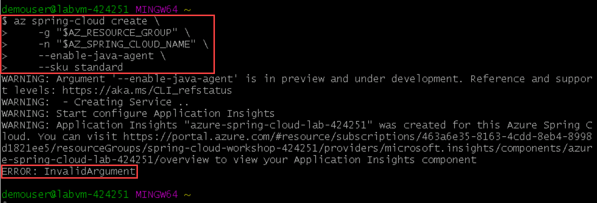
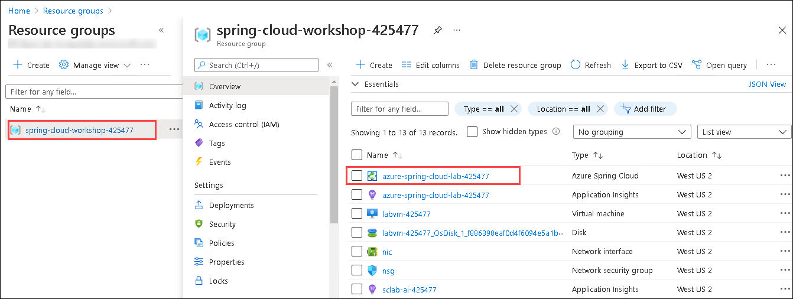
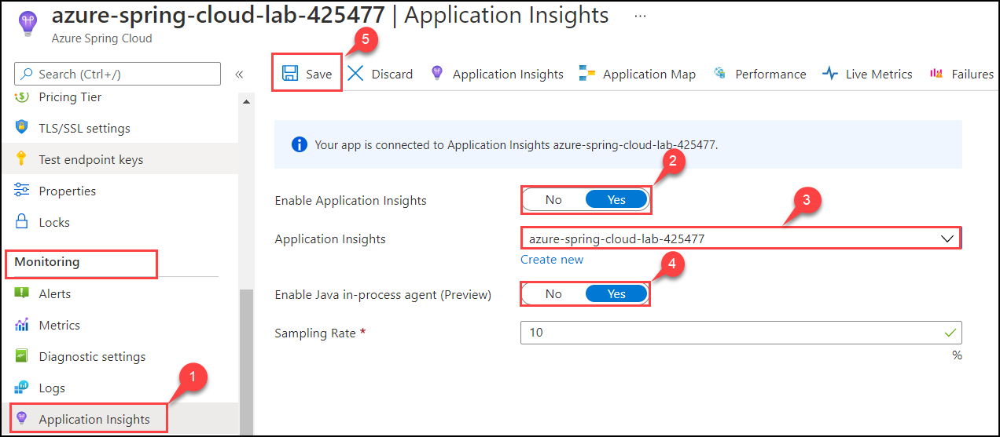

# Exercise 1 - Create an Azure Spring Cloud instance

In this section, we'll create an Azure Spring Cloud instance using Azure CLI. While there are other ways of creating Azure resources, Azure CLI is the quickest and simplest method.

---
### Task 1: Verify Azure Subscription

1. Minimize the Azure portal and search for **git** in the Search Box.
2. Select **Git Bash** and run the below commands.

>💡 Make sure you enter these commands and all others that follow in **Git Bash**. **Do not use WSL, CloudShell, or any other shell.**, Ensure your Azure CLI is logged into your Azure subscription.


   

```bash
az login # Sign into an azure account
```
> **Note:** Once you run the command, you will be redirected to the default browser, and then enter the **AD username:** <inject key="AzureAdUserEmail"></inject> and **Password:** <inject key="AzureAdUserPassword"></inject>, close the tab when you see the successful login message and proceed with the next command.

```bash
az account show # See the currently signed-in account.
```

### Task 2: Create an Azure Spring Cloud instance

1. In this section, we will create our Azure Spring Cloud instance using Azure CLI.

2. First, you will need to come up with a name for your Azure Spring Cloud instance.

3. The name must be unique among all Azure Spring Cloud instances across all of Azure. Consider using **azure-spring-cloud-lab-DID** where **DID** is the **DeploymentID** (Unique Id) which can be found from the **Environment Details** page.

4. To limit typing, set the variable `AZ_RESOURCE_GROUP` to the name of the resource group **spring-cloud-workshop-<inject key="DeploymentID" enableCopy="false"/>**. And set the variable `AZ_SPRING_CLOUD_NAME` to **azure-spring-cloud-lab-<inject key="DeploymentID" enableCopy="false"/>**

>🛑 Be sure to substitute the DID with **<inject key="DeploymentID" enableCopy="True"/>** in `AZ_RESOURCE_GROUP` and `AZ_SPRING_CLOUD_NAME`

```bash
AZ_RESOURCE_GROUP=spring-cloud-workshop-DID
AZ_SPRING_CLOUD_NAME=azure-spring-cloud-lab-DID
az config set extension.use_dynamic_install=yes_without_prompt
```

5. With these variables set, we can now create the Azure Spring Cloud instance. To enable the Java in-process monitoring agent, we add the `enable-java-agent` flag.

```bash
az spring-cloud create \
    -g "$AZ_RESOURCE_GROUP" \
    -n "$AZ_SPRING_CLOUD_NAME" \
    --enable-java-agent \
    --sku standard
```
<!--- > Note : Please note that the above command will throw an **error: InvalidArgument** as shown below :
         
   
         
6. Navigate to the **Resource group**:**spring-cloud-workshop-DID** and select the newly created **azure-spring-cloud-lab-DID**. 

   
   
7. Now, under **Monitoring** select **Application insights**.

     - `Enable Application Insights` : **Yes**
     - `Application Insights` : **azure-spring-cloud-lab-DID**
     - `Enable Java in-process agent(preview)` : **Yes**
     - `Sampling Rate` : **Default**
     
    

8. Finally select **Save** to save the settings.
---> 
6. For the remainder of this workshop, we will be running Azure CLI commands referencing the same resource group and Azure Spring Cloud instance. So let's set them as defaults, so we don't have to specify them again:

```bash
az configure --defaults group=$AZ_RESOURCE_GROUP
az configure --defaults spring-cloud=$AZ_SPRING_CLOUD_NAME
```

---
