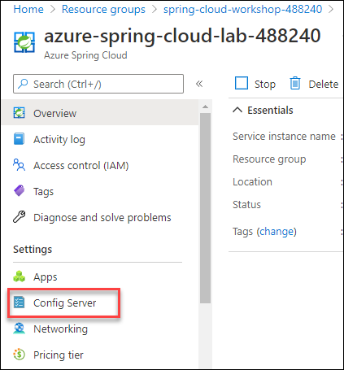
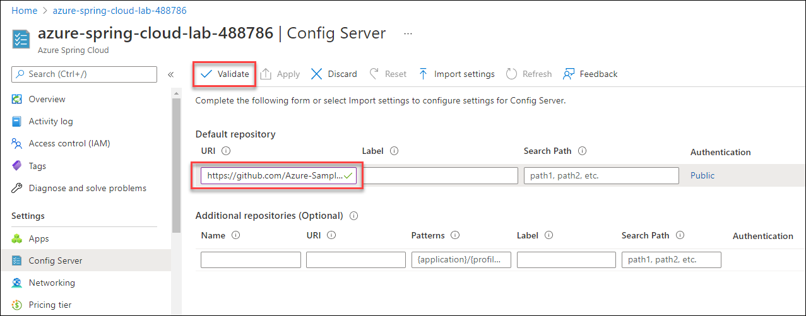

# Exercise 4 - Configure a Spring Cloud Config server

A key feature of cloud-native applications is *externalized configuration* - the ability to store, manage, and version configuration separately from the application code. In this section, we'll configure a [Spring Cloud Config Server](https://cloud.spring.io/spring-cloud-config) to enable this functionality. In the next section, you'll see how Spring Cloud Config can inject configuration from a Git repository into your application.

---

## Task 1 : Configure Azure Spring Cloud to access the Git repository

1. Navigate to Azure Portal (```https://portal.azure.com```). From the resource group **spring-cloud-workshop-<inject key="DeploymentID" enableCopy="false"/>** select the Azure Spring Cloud Instance named **azure-spring-cloud-lab-<inject key="DeploymentID" enableCopy="false"/>**.

2. Go to the **Overview** page of Azure Spring Cloud server and select `Config server` in the menu under `Settings`

   

3. On the **Config Server** page, follow the below mentioned instructions:

      - Configure the repository by providing the public repository URL **https://github.com/Azure-Samples/spring-cloud-sample-public-config.git** inside URL field of **Default repository**

     >💡 Make sure you include the `.git` ending in the URL.
 
     - Click on "Validate" and wait for the operation to succeed  
     
      
   
5. Click on "Apply" and wait for the operation to succeed

## Review

We have now created a private configuration repository. We have enabled Azure Spring Cloud to create a configuration server with the configuration files from this repository.

In the next section, we will create an application that consumes this configuration, specifically the custom message we defined in `application.yml`.

---
