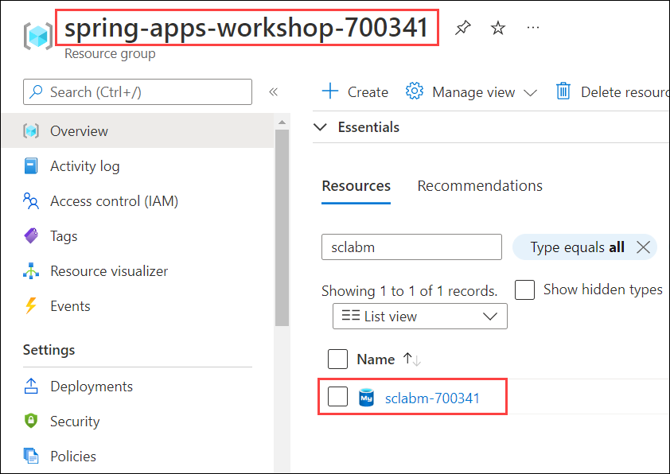
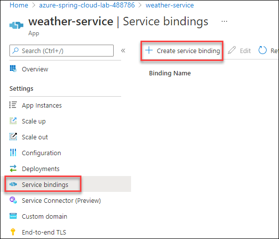
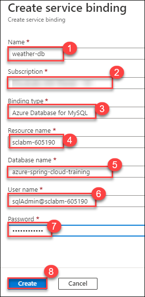

# Exercise 7 - Build a Spring Boot microservice using MySQL

In this section, we'll build another data-driven microservice. This time, we will use a relational database, a [MySQL database managed by Azure](https://docs.microsoft.com/en-us/azure/mysql/?WT.mc_id=azurespringcloud-github-judubois). And we'll use Java Persistence API (JPA) to access the data in a way that is more frequently used in the Java ecosystem.

---

## Task 1 : Create the application on Azure Spring Apps

1. Navigate back to Gitbash and run the below command to create a specific `weather-service` application in your Azure Spring Apps instance:

> **Note**: Replace the DID with **<inject key="DeploymentID" enableCopy="True"/>** value, you can also find it from Environment details page.

```bash
az spring app create -n weather-service -s azure-spring-apps-lab-DID --runtime-version Java_17
```
 
## Task 2 : Configure the MySQL Server instance

1. Navigate to Azure Database for MySQL instance named **sclabm-<inject key="DeploymentID" enableCopy="false"/>** in the resource group **spring-apps-workshop-<inject key="DeploymentID" enableCopy="false"/>**.

   

2. Before we can use it however, we will need to perform several tasks:

    - Create a MySQL firewall rule to allow connections from our local environment.
    - Create a MySQL firewall rule to allow connections from Azure Services. This will enable connections from Azure Spring Apps.
    - Create a MySQL database.
 
3. Run the following commands in **Git Bash**. Make sure you are logged in to your Azure account. If not log in using `az login`.

```bash
# Obtain the info on the MYSQL server in our resource group:
MYSQL_INFO=$(az mysql server list --query '[0]')
MYSQL_SERVERNAME=$(az mysql server list --query '[0].name' -o tsv)
MYSQL_USERNAME="$(az mysql server list --query '[0].administratorLogin' -o tsv)@${MYSQL_SERVERNAME}"
MYSQL_HOST="$(az mysql server list --query '[0].fullyQualifiedDomainName' -o tsv)"

# Create a firewall rule to allow connections from your machine:
MY_IP=$(curl whatismyip.akamai.com 2>/dev/null)
az mysql server firewall-rule create \
    --server-name $MYSQL_SERVERNAME \
    --name "connect-from-lab" \
    --start-ip-address "$MY_IP" \
    --end-ip-address "$MY_IP"

# Create a firewall rule to allow connections from Azure services:
az mysql server firewall-rule create \
    --server-name $MYSQL_SERVERNAME \
    --name "connect-from-azure" \
    --start-ip-address "0.0.0.0" \
    --end-ip-address "0.0.0.0"

# Create a MySQL database
az mysql db create \
    --name "azure-spring-cloud-training" \
    --server-name $MYSQL_SERVERNAME

# Display MySQL username (to be used in the next section)
echo "Your MySQL username is: ${MYSQL_USERNAME}"


```
## Task 3 : Bind the MySQL database to the application

As we did for CosmosDB in the previous exercise, create a service binding for the MySQL database to make it available to Azure Spring Apps microservices.

1. Navigate back to Azure Portal, From the resource group **spring-apps-workshop-<inject key="DeploymentID" enableCopy="false"/>**, select the Azure Spring Apps instance named **azure-spring-apps-lab-<inject key="DeploymentID" enableCopy="false"/>**.

2. Click on Apps under **Settings**.

   

3. Click on `weather-service`.

4. Click on **Service Bindings** under **Settings** and then select **+ Create Service Binding**.

   

5. Populate the service binding fields as shown.

  - Name : **weather-db**
  - Binding type : **Azure Database for MySQL**
  - Resource name : **sclabm-<inject key="DeploymentID" enableCopy="false"/>**
  - Database name : **azure-spring-cloud-training**
  - User name : **sqlAdmin@sclabm-<inject key="DeploymentID" enableCopy="false"/>**
  - Password : **<inject key="MySQL Server Password" />**
  - Click on **Create** to create the database binding

    

## Task 4 : Create a Spring Boot microservice

Now that we've provisioned the Azure Spring Apps instance and configured the service binding, let's get the code for `weather-service` ready.

1. To create our microservice, we will navigate to https://start.spring.io/, add the dependencies **Spring Web**, **Spring Data JPA**, **MySQL Driver**, **Eureka Discovery Client** and the **Config Client** and click on **Generate**. This will download a zip file named **demo**, extract the files to `C:\Users\demouser` and rename the **demo** folder to **weather-service**.


2. Navigate to the path `C:\Users\demouser\weather-service` to find the weather-service  folder 


> **Note**:  We use the `Spring Web`, `Spring Data JPA`, `MySQL Driver`, `Eureka Discovery Client` and the `Config Client` components.

## Task 5 : Add Spring code to get the data from the database

1. Navigate to the path `C:\Users\demouser\weather-service\src\main\java\com\example\demo`. Next to the `DemoApplication` class, create a `Weather.java` JPA entity:

```java
package com.example.demo;

import javax.persistence.Entity;
import javax.persistence.Id;

@Entity
public class Weather {

    @Id
    private String city;

    private String description;

    private String icon;

    public String getCity() {
        return city;
    }

    public void setCity(String city) {
        this.city = city;
    }

    public String getDescription() {
        return description;
    }

    public void setDescription(String description) {
        this.description = description;
    }

    public String getIcon() {
        return icon;
    }

    public void setIcon(String icon) {
        this.icon = icon;
    }
}
```

2. Then, in the same location create a Spring Data repository to manage this entity, called `WeatherRepository.java`:

```java
package com.example.demo;

import org.springframework.data.repository.CrudRepository;

public interface WeatherRepository extends CrudRepository<Weather, String> {
}
```

3. And finish coding this application by adding a Spring MVC controller called `WeatherController.java`:

```java
package com.example.demo;

import org.springframework.stereotype.Controller;
import org.springframework.web.bind.annotation.*;

@RestController
@RequestMapping(path="/weather")
public class WeatherController {

    private final WeatherRepository weatherRepository;

    public WeatherController(WeatherRepository weatherRepository) {
        this.weatherRepository = weatherRepository;
    }

    @GetMapping("/city")
    public @ResponseBody Weather getWeatherForCity(@RequestParam("name") String cityName) {
        return weatherRepository.findById(cityName).get();
    }
}
```

## Task 6 : Add sample data in MySQL

1. In order to have Hibernate automatically create your database, open up the `C:\Users\demouser\weather-service\src\main\resources\` and application.properties file and add:

```properties
spring.jpa.hibernate.ddl-auto=create
```

2. Then, in order to have Spring Boot add sample data at startup, in the same location create a `import.sql` file and add:

```sql
INSERT INTO `azure-spring-cloud-training`.`weather` (`city`, `description`, `icon`) VALUES ('Paris, France', 'Very cloudy!', 'weather-fog');
INSERT INTO `azure-spring-cloud-training`.`weather` (`city`, `description`, `icon`) VALUES ('London, UK', 'Quite cloudy', 'weather-pouring');
```

## Task 7 : Deploy the application

1. Navigate back to Gitbash and run the below commands to now build your "weather-service" project and send it to Azure Spring Apps.

```bash
cd weather-service
./mvnw clean package -DskipTests
az spring app deploy -n weather-service -s azure-spring-apps-lab-DID --artifact-path target/demo-0.0.1-SNAPSHOT.jar
cd ..
```
> **Note**: Replace the DID with **<inject key="DeploymentID" enableCopy="True"/>** value, you can also find it from Environment details page.


## Task 8 : Test the project in the cloud

1. Go to **Apps** in your Azure Spring Apps instance.

2. Verify that `weather-service` has a `Registration status` which says `1/1`. This shows that it is correctly registered in the Spring Cloud Service Registry.

3. Select `weather-service` to have more information on the microservice.

4. Copy the "Test Endpoint" that is provided. You might have to click on `See more` to find it.

5. Now you can now use CURL to test the `/weather/city` endpoint. For example, to test for `Paris, France` city, append to the end of the test endpoint: `/weather/city?name=Paris%2C%20France`.

You should get:

```json
{"city":"Paris, France","description":"Very cloudy!","icon":"weather-fog"}
```
---

