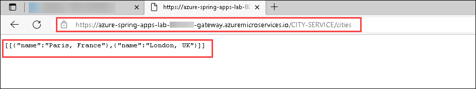

# Exercise 8 - Build a Spring Cloud Gateway

A Spring Cloud gateway allows you to selectively expose your microservices and route traffic to them and among them. In this section, we will create a Spring Cloud Gateway that will expose the microservices we created in the preceding two sections.

---

## Task 1 : Create a Spring Cloud Gateway

1. Run the below command to create a gateway, where you will invoke the Spring Initializer service.

    ```bash
    curl https://start.spring.io/starter.tgz -d type=maven-project -d dependencies=cloud-gateway,cloud-eureka,cloud-config-client -d baseDir=gateway -d bootVersion=2.7.5 -d javaVersion=17 | tar -xzvf -
    ```
2. Navigate to the path `C:\Users\demouser\gateway` to find the gateway folder 

   

   > **Note**: We use the `Cloud Gateway`, `Eureka Discovery Client`, and the `Config Client` components.

## Task 2 : Configure the application

1. Navigate to `C:\Users\demouser\gateway\src\main\resources`, open the `application.properties` file and add the following configuration. Click on File tab and select `Save As`. Enter the File name as `application.yml` and Save as type as `All Files`, then click on `Save`.
   
   ```yaml
   spring:
     cloud:
       gateway:
         discovery:
           locator:
             enabled: true
         globalcors:
           corsConfigurations:
             '[/**]':
               allowedOrigins: "*"
               allowedMethods:
                 - GET
                 
    ```
 
    
 
  - The `spring.cloud.gateway.discovery.locator.enabled=true` part is to configure Spring Cloud Gateway to use the Spring Cloud Service Registry to discover the available microservices.
  
  - The `spring.cloud.gateway.globalcors.corsConfiguration` part is to allow CORS requests to our gateway. This will be helpful in the next guide, when we will add a front-end that is not hosted on Azure Spring Apps.

## Task 3 : Create the application on Azure Spring Apps

1. Navigate to Git Bash and create a specific `gateway` application in your Azure Spring Apps instance. As this application is a gateway, we add the `--assign-endpoint true` flag so it is exposed publicly.

   >**Note**: Replace the DID with the **<inject key="DeploymentID" enableCopy="True"/>** value, you can also find it from the Environment details page.

   ```bash
   az spring app create -n gateway -g spring-apps-workshop-DID -s azure-spring-apps-lab-DID --runtime-version Java_17 --assign-endpoint true
   ```
 
## Task 4 : Deploy the application

1. Run the below command to build your "gateway" project and send it to Azure Spring Apps:

   ```bash
   cd gateway
   ./mvnw clean package -DskipTests
   az spring app deploy -n gateway -g spring-apps-workshop-DID --artifact-path target/demo-0.0.1-SNAPSHOT.jar
   cd ..
   ```

## Task 5 : Test the project in the cloud

1. Navigate back to Azure Portal, From the resource group **spring-apps-workshop-<inject key="DeploymentID" enableCopy="false"/>** select the Azure Spring Apps instance named **azure-spring-apps-lab-<inject key="DeploymentID" enableCopy="false"/>**.

2. Click on **Apps** under **Settings**.

   

3. Verify that `gateway` has a `Registration status` which says `1/1`. This shows that it is correctly registered in the Spring Cloud Service Registry.

4. Select the `gateway` to have more information on the microservice.

5. Copy the public URL that is provided (there is a **Test Endpoint** like for microservices, but the gateway is directly exposed on the Internet, so let's use the public URL). Keep this URL handy for subsequent sections.

   

6. As the gateway is connected to the Spring Cloud Service Registry, it should have automatically opened routes to the available microservices, with URL paths in the form of `/MICROSERVICE-ID/**`:
[The MICROSERVICE-ID must be in capital letters]

7. Test the `city-service` microservice endpoint by by browsing it Microsoft Edge: `https://XXXXXXXX-gateway.azuremicroservices.io/CITY-SERVICE/cities` (replacing XXXXXXXX with the name of your Azure Spring Apps instance)

   

8. Test the `weather-service` microservice endpoint by browsing it on Microsoft Edge: `https://XXXXXXXX-gateway.azuremicroservices.io/WEATHER-SERVICE/weather/city?name=Paris%2C%20France` (replacing XXXXXXXX by the name of your gateway)

   
      
---
