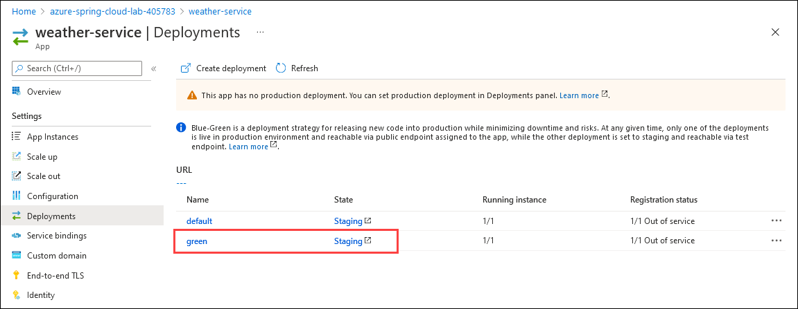

# Exercise 10 - Blue/Green deployment

The blue-green deployment pattern allows you to test latest application changes on production infrastructure, but without exposing the changes to consumers until your testing is complete. In this section, we'll perform a blue-green deployment with Azure CLI. Although we will go through the deployment steps manually, the Azure CLI commands we'll use can be automated in a CI/CD pipeline.

---

We are going to deploy a new release of the "weather-service" microservice that was developed in exercise 7.

## Task 1 : Modify the current application

1. Navigate to `C:\Users\demouser\weather-service\src\main\java\com\example\demo` and open the `WeatherController` class and modify its `getWeatherForCity()` method so it always returns sunny weather (this will be an easy-to-spot graphical view of our modifications in the code):

```java
package com.example.demo;

import org.springframework.stereotype.Controller;
import org.springframework.web.bind.annotation.*;

@Controller
@RequestMapping(path="/weather")
public class WeatherController {

    private final WeatherRepository weatherRepository;

    public WeatherController(WeatherRepository weatherRepository) {
        this.weatherRepository = weatherRepository;
    }

    @GetMapping("/city")
    public @ResponseBody Weather getWeatherForCity(@RequestParam("name") String cityName) {
        return weatherRepository.findById(cityName).map(weather -> {
            weather.setDescription("It's always sunny on Azure Spring Apps");
            weather.setIcon("weather-sunny");
            return weather;
        }).get();
    }
}
```

## Task 2 : Deploy the new application to a new "green" deployment

1. Navigate to Git Bash and build a new version of the application and deploy it to a new `deployment` called `green`:

```bash
cd weather-service
./mvnw clean package -DskipTests
az spring app deployment create --name green --app weather-service --runtime-version Java_17 --artifact-path target/demo-0.0.1-SNAPSHOT.jar
cd ..
```

2. Once the application is deployed, if you go to `https://spring-training.azureedge.net/` you will still have the same data, as the new version of the microservice is now in a staging area and not in production yet.

3. Navigate back to Azure Portal, From the resource group **spring-apps-workshop-<inject key="DeploymentID" enableCopy="false"/>** select the Azure Spring Apps instance named **azure-spring-apps-lab-<inject key="DeploymentID" enableCopy="false"/>**.

4. Click **Apps** in the **Settings** section of the navigation pane and select **weather-service**.

5. Click **Deployments** under *Settings* and you should now see **green** deployment in **Staging** state.

   

4. You can test the `green` deployment by invoking the same URL as in exercise 7, but replacing the deployment name `default` with `green`:

```bash
curl https://***.test.azuremicroservices.io/weather-service/green/weather/city?name=Paris%2C%20France
```

5. And you should see the result of the recent modification:

   > **{"city":"Paris, France","description":"It's always sunny on Azure Spring Cloud","icon":"weather-sunny"}**


   > **Note**: We're not testing the green deployment through the `gateway` application. The purpose of a green deployment is to test changes to a microservice before routing production traffic to it. Therefore, if you access `weather-service` through the public Gateway URL, as you did in exercise 8, you will be routed to the original version of the service.

---
