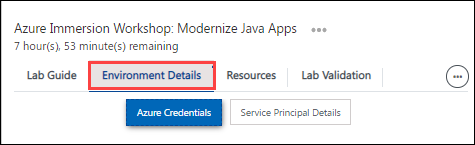
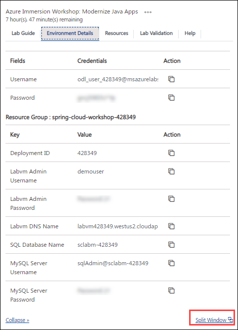
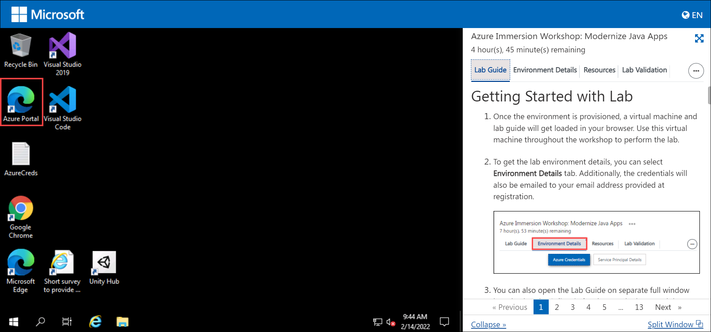

# Getting Started with Lab

1. Once the environment is provisioned, a virtual machine and lab guide will get loaded in your browser. Use this virtual machine throughout the workshop to perform the lab.

1. To get the lab environment details, you can select **Environment Details** tab. Additionally, the credentials will also be emailed to your email address provided at registration.

   
  
1. You can also open the Lab Guide on separate full window by selecting the **Split Window** icon at the bottom right corner.

   
 
## Set default browser

1. In the VM, search for "Default Apps". 

   
   
1. Scroll down to the web browser option at the bottom and select "Microsoft Edge".

   
 
## Login to Azure Portal

1. In the VM, click on Azure portal shortcut of Microsoft Edge browser which is created on desktop.

   
   
1. When you click on Azure portal, edge browser welcome screen will come up, select **Start without your data**.

   
   
1. On next window, click on **Confirm and start browsing**.

   
   
1. Now, you will see two tabs in edge browser, close first tab named with **Microsoft Edge**.
   
1. On **Sign in to Microsoft Azure** tab you will see login screen, in that enter following email/username and then click on **Next**. 

   * Email/Username: <inject key="AzureAdUserEmail"></inject>
   
     
     
1. Now enter the following password and click on **Sign in**.

   * Password: <inject key="AzureAdUserPassword"></inject>
   
     
     
1. If you see the pop-up **Stay Signed in?**, click **No**.

1. If you see the pop-up **You have free Azure Advisor recommendations!**, close the window to continue the lab.

1. If a **Welcome to Microsoft Azure** popup window appears, click **Maybe Later** to skip the tour.
  
